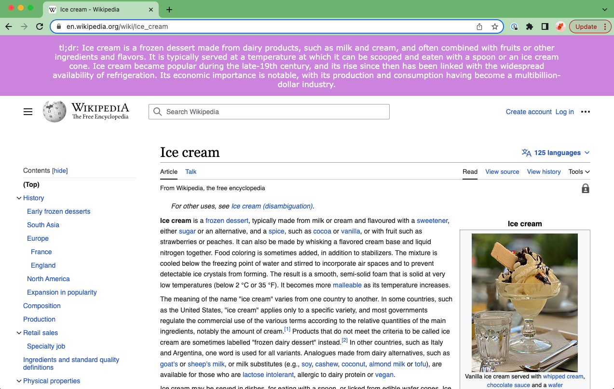
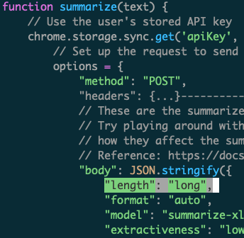
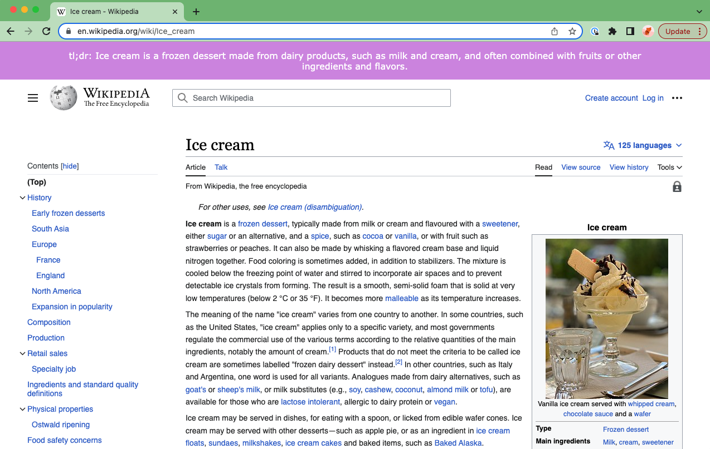
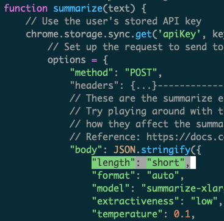

```
################################################################################
#    ____      _                     ____                  _ _                 #
#   / ___|___ | |__   ___ _ __ ___  / ___|  __ _ _ __   __| | |__   _____  __  #
#  | |   / _ \| '_ \ / _ \ '__/ _ \ \___ \ / _` | '_ \ / _` | '_ \ / _ \ \/ /  #
#  | |__| (_) | | | |  __/ | |  __/  ___) | (_| | | | | (_| | |_) | (_) >  <   #
#   \____\___/|_| |_|\___|_|  \___| |____/ \__,_|_| |_|\__,_|_.__/ \___/_/\_\  #
#                                                                              #
# This project is part of Cohere Sandbox, Cohere's Experimental Open Source    #
# offering. This project provides a library, tooling, or demo making use of    #
# the Cohere Platform. You should expect (self-)documented, high quality code  #
# but be warned that this is EXPERIMENTAL. Therefore, also expect rough edges, #
# non-backwards compatible changes, or potential changes in functionality as   #
# the library, tool, or demo evolves. Please consider referencing a specific   #
# git commit or version if depending upon the project in any mission-critical  #
# code as part of your own projects.                                           #
#                                                                              #
# Please don't hesitate to raise issues or submit pull requests, and thanks    #
# for checking out this project!                                               #
#                                                                              #
################################################################################
```

**Maintainer:** [leilacc](https://github.com/leilacc) \
**Project maintained until at least (YYYY-MM-DD):** 2023-12-15

# Condense
Condense is a Chrome Extension that summarizes webpages using Cohere's cutting-edge summarization endpoint, [co:summarize](https://docs.cohere.com/reference/summarize-2).
co:summarize is deceptively simple yet powerful API for generating topical, concise, and natural-sounding summaries from any given text.
This Chrome Extension passes the visible text from websites we visit to co:summarize and generates a purple tl;dr header at the top of every page.
It shines when it comes to summarizing pages with a lot of text about a specific topic, like Wikipedia and news articles - or even this one!

You can see the Condense summary in the purple header here:


## How it works
[condense/scripts/content.js](condense/scripts/content.js)
1. The [manifest file](condense/manifest.json) contains simple boilerplate that's required by all Chrome Extensions.
2. The [Options](condense/options) pop-up to allow users to submit their Cohere API key. All requests to Cohere's APIs, including co:summarize, must be accompanied by a valid API key which can be [generated for free at our website](https://dashboard.cohere.ai/api-keys).
3. [getVisibleText()](condense/scripts/content.js#L84) captures the visible text on a webpage.
4. [summarize(text)](condense/scripts/content.js#L35) summarizes the visible text using co:summarize.
5. [display(text)](condense/scripts/content.js#L14) displays the summary as a purple header.

## How to use the extension
1. Clone this repo by downloading it to your local computer.
2. Go to chrome://extensions/.
3. At the top right, turn on Developer mode.
4. Click Load unpacked.
5. Find and select the folder where you downloaded this repo, then select the /condense folder within it.
6. Select Details on the app, go to Extension Options, and then add an API key (use a trial key).
7. Open a new tab in Chrome, click Apps, and then click the app or extension.
8. You'll know it's working if you see a purple banner at the top of every new page you load in Chrome.
9. Test it out! See what kind of summaries you get from [long articles](https://en.wikipedia.org/wiki/Ice_cream) and compare them to summaries on [pages without much visible text](https://dashboard.cohere.ai/playground/generate).

## Limitations and known issues
This extension is not polished to a shiny production-ready finish. Rather, it's intended to showcase one simple yet compelling use of co:summarize and help developers get a head start on their own extensions. It will produce reasonable and high-quality summaries in many but not all circumstances. Here are some limitations and issues you should be aware of:

- co:summarize requires at least 250 characters of input text, otherwise it returns an error.
- co:summarize only supports 100k characters of input text. Condense will only send the first 100k visible characters.
- `getVisibleText()` does not actually capture all visible text on all pages, particularly text that's loaded asynchronously. It also sometimes captures text that isn't actually visible, which can lead to confusing summaries that don't seem relevant.
- the header created by `display(text)` sometimes gets hidden behind other headers on the page
- Condense uses fixed parameters when it calls co:summarize. These parameters are optimized to provide relatively long summaries of relatively long pages, but perform less well on shorter pages. Modifying the parameters (particularly length and extractiveness) will affect the summarization characteristics and the perceived summary quality on different types of webpages. See [Customizing your summarizations](#customizing-your-summarizations) for more information.

## Customizing your extension
You're free to fork, download, and modify this code as much as you'd like! In fact, we encourage it. You can even publish your own new-and-improved version.

### Customizing summarizations
The summarize function in [condense/scripts/content.js](condense/scripts/content.js) contains various parameters for Cohere's Summarize API. You can adjust them to see how different values will affect the summarization.

For example, you may wish to customize the API calls by requesting `length: short` summaries on home pages, where there isn't much to summarize, and `length: long` on pages with a lot of text.

Here's an example of a summary with `length: long` (the default for Condense):



And the same page with a different summary after changing the summary length to `length: short`:



You can read more about the available co:summarize parameters [here](https://docs.cohere.com/reference/summarize-2).

### Customizing other features
You can change anything you want about the extension! Maybe you want the header to be red, or maybe you want to tackle some of the known issues listsed above. The sky's the limit. To get you started, here are some ideas that would improve Condense:

- Allow users to set their own API options like model and temperature
- Allow users to request longer summaries if they want more detail
- Wait until page contents have finished loading before running (to be able to summarize content that's loaded asynchronously)
- Allow specific websites to be included or excluded
- Or, only summarize pages on user command - eg via a shortcut
- Be smarter about injecting the header - on some pages it gets hidden behind other headers
- Allow users to highlight specific text and summarize only those parts
- Generally make the UX prettier/nicer
- Handle API errors in a nicer way (currently they are displayed in the summary header, not a great UX)

# Contributors
If you would like to contribute to this project, please read `CONTRIBUTORS.md`
in this repository, and sign the Contributor License Agreement before submitting
any pull requests. A link to sign the Cohere CLA will be generated the first time 
you make a pull request to a Cohere repository.

# License
Condense has an MIT license, as found in the LICENSE file.
