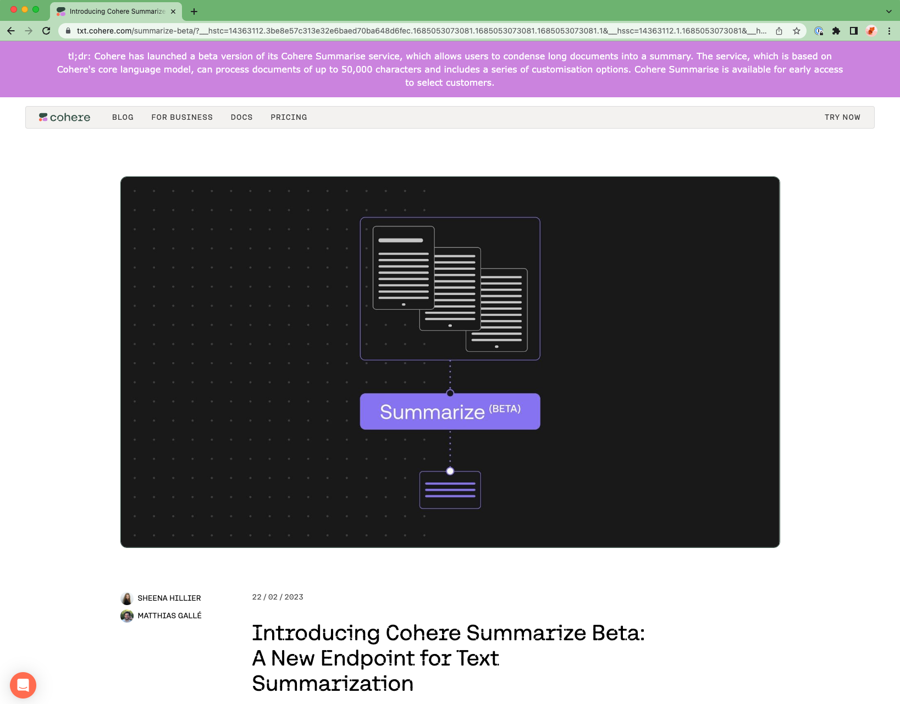

```
################################################################################
#    ____      _                     ____                  _ _                 #
#   / ___|___ | |__   ___ _ __ ___  / ___|  __ _ _ __   __| | |__   _____  __  #
#  | |   / _ \| '_ \ / _ \ '__/ _ \ \___ \ / _` | '_ \ / _` | '_ \ / _ \ \/ /  #
#  | |__| (_) | | | |  __/ | |  __/  ___) | (_| | | | | (_| | |_) | (_) >  <   #
#   \____\___/|_| |_|\___|_|  \___| |____/ \__,_|_| |_|\__,_|_.__/ \___/_/\_\  #
#                                                                              #
# This project is part of Cohere Sandbox, Cohere's Experimental Open Source    #
# offering. This project provides a library, tooling, or demo making use of    #
# the Cohere Platform. You should expect (self-)documented, high quality code  #
# but be warned that this is EXPERIMENTAL. Therefore, also expect rough edges, #
# non-backwards compatible changes, or potential changes in functionality as   #
# the library, tool, or demo evolves. Please consider referencing a specific   #
# git commit or version if depending upon the project in any mission-critical  #
# code as part of your own projects.                                           #
#                                                                              #
# Please don't hesitate to raise issues or submit pull requests, and thanks    #
# for checking out this project!                                               #
#                                                                              #
################################################################################
```

**Maintainer:** [leilacc](https://github.com/leilacc) \
**Project maintained until at least (YYYY-MM-DD):** 2023-12-06

# Condense
Condense is a Chrome Extension that summarizes webpages using Cohere's summarize endpoint.

Here's what it look like - it's the purple header:



## To use the extension
1. Clone this repo.
2. Go to chrome://extensions/.
3. At the top right, turn on Developer mode.
4. Click Load unpacked.
5. Find and select the app or extension folder.
6. Select Details on the app, and then add an API key (use a trial key) in Extension Options.
7. Open a new tab in Chrome and then click Apps and then click the app or extension. Make sure it loads and works correctly.

## Ideas for future work
- Allow users to set their own API options like model and temperature
- Allow users to request longer summaries if they want more detail
- Wait until page contents have finished loading before running (to be able to summarize content that's loaded asynchronously)
- Allow specific websites to be included or excluded, instead of running on all
- Or, only summarize pages on user command - eg via a shortcut
- Be smarter about injecting the header - on some pages it gets hidden behind other headers
- Allow users to highlight specific text and summarize only those parts
- Generally make the UX prettier/nicer

# Contributors
If you would like to contribute to this project, please read `CONTRIBUTORS.md`
in this repository, and sign the Contributor License Agreement before submitting
any pull requests. A link to sign the Cohere CLA will be generated the first time 
you make a pull request to a Cohere repository.

# License
Condense has an MIT license, as found in the LICENSE file.
