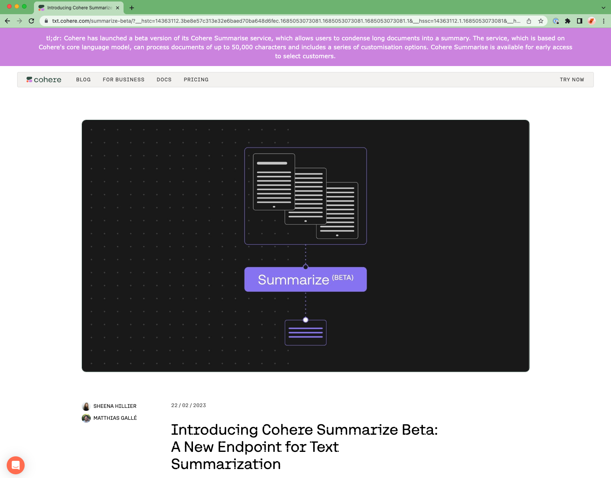

# co:ndense
co:ndense is a Chrome Extension that summarizes webpages using the summarize endpoint.

I made it as an onboarding exercise to learn more about Cohere's products. This is what it look like (purple header):

## To use the extension
1. Clone this repo.
2. Go to chrome://extensions/.
3. At the top right, turn on Developer mode.
4. Click Load unpacked.
5. Find and select the app or extension folder.
6. Open a new tab in Chromeand then click Apps and then click the app or extension. Make sure it loads and works correctly.

## Ideas for future work
- allow users to set their own API options like model and temperature
- wait until page contents have finished loading before running (to be able to summarize content that's loaded asynchronously)
- or only summarize pages on user command, eg via a shortcut
- allow users to highlight specific text and summarize only those parts
- generally make the UX prettier/nicer
